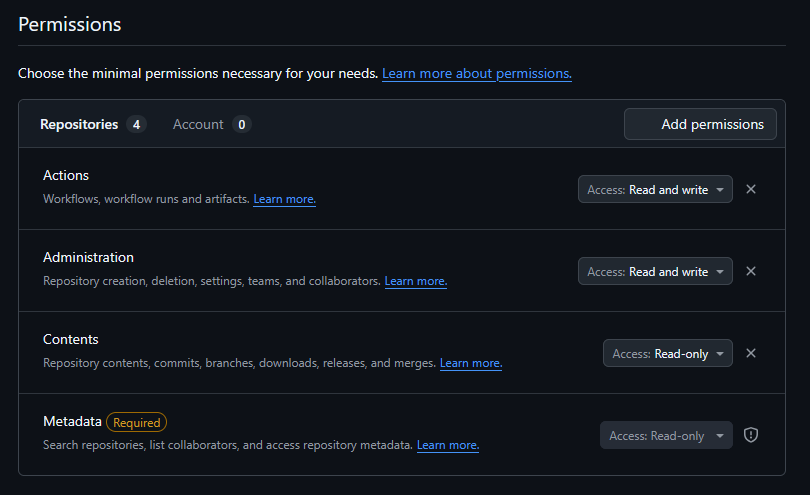
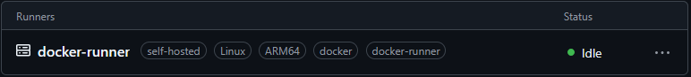

# Github actions self-hosted runner
Run unlimited GitHub Actions builds on your own hardware with complete control!

This repository contains the needed code to set up a containerized self-hosted Github Actions runner.

The aim of this Github Actions Self-hosted Runner is to automate the deployment phase with a CI/CD-like approach.

An example should be the following one:

Github Repository --> Push commit on GH Repository --> GH Actions Job --> GH SH Runner --> Deploy on Home Server. 

## Why Self-Host Your GitHub Actions Runner?
Self-hosted runners give you complete control over your GitHub Actions environment.

- **No GitHub-hosted billing limits**: No worrying about monthly limit.
- **Custom Environment**: Install exactly the software and tools you need.
- **Hardware-dependent performance**: Use your own powerful hardware for faster builds.
- **Privacy**: Keep sensitive builds and data on your own infrastructure.
- **Faster Builds**: Skip download times for large dependencies by caching them on your runner.

## Prerequisites
Before we dive in, make sure to have:
- The bare metal (whatever is a computer with windows, macOS, linux... It doesn't really matter)
- Admin access to that machine
- Admin access on your Github repository
- **Docker** and **Docker Compose** installed
- Basic terminal knowledge

## System Requirements
GitHub Actions runners are surprisingly lightweight:

- **RAM**: 2GB minimum (4GB recommended for Docker workflows)
- **Storage**: 10GB free space for the runner and your builds
- **CPU**: Any modern processor (x64, ARM64, ARM32 supported)
- **Network**: Stable internet connection to GitHub

In this case, we're gonna deploy a Github Actions Runner onto a Raspberry Pi 5 (ARM64).

# Configuration
## 1. Create a Fine-Grained Personal Access Token (PAT)
In order to make the Runner authenticates with your Github repository (and bind the Runner to that), this dockerized Runner uses PAT for automatic runner registration and token refresh.

1. Go to [Github Personal Access Token](https://github.com/settings/tokens)
1. Click **Generate new token** (Fine-grained tokens)
1. Set **Expiration** to 30-days (safer)
1. Give your token a name (e.g. *"Self-hosted Runner"*)
1. Select **Only select repositories**
    - Select the repositories you want the Runner to register to
1. Add right permissions: 
    - `Administration` - Read and Write
    - `Actions` - Read and Write
    - `Contents` - Read-Only
    - `Metadata` - Read-Only (required)

    You should have something like this:

    
1. Click **Generate token**
1. Copy your token

    >⚠️ Copy and save somewhere safe your token, it wont be visible once you exit the PAT creation page.

    > ⚠️ Keep your PAT secret! Never share it or commit into your source code.

## 2. Create the Docker setup
1. Create a new directory for your Runner:
    ```bash
    mkdir github-runner && cd github-runner
    ```
1. Create a **Dockerfile**
    This is the instruction file that Docker uses to build the Runner image.

    Check `Dockerfile` on the root of this folder.

1. Create a **start.sh** script
    This script contains the startup commands that the Runner runs at startup.

    Check `start.sh` on the root of this folder.

1. Create a **compose.yml** file
    > With Docker Compose you use a YAML configuration file, known as the Compose file, to configure your application’s services, and then you create and start all the services from your configuration with the Compose CLI.

    This file contains the `yaml` configuration of this your Runner

    Check `compose.yml` on the root of this folder.

    Important Configuration Notes:

    - **Architecture**: Set *RUNNER_ARCH* to arm64 for Raspberry Pi/ARM processors, or x64 for Intel/AMD processors
    - **Token Security**: Use *ACCESS_TOKEN* in your .env file for automatic runner token generation
    - **Repository Setup**: Set *REPO_URL* in your .env file to your actual repository URL.
    - **Labels**: Update the architecture in labels (arm64 or x64) to match your system

1. Set up `.env` file

    Make a copy of `.env.example` file and rename it as `.env`

    ```bash
    cp .env.example .env
    ```

    Fulfill the needed environment variables.

## 3. Build and start your dockerized Runner

### Build and start the Runner
```bash
# Build the container Runner image
docker compose build

# Start the Runner container
docker compose up -d
```

Since we're using Docker Compose, we can build and run the Runner in a single command: 

```bash
docker compose up -d --build
```

### Check Runner logs
If everything has worked as intended, you should be looking at something like this:

```bash
Added runner to docker group with GID <truncate> 
Getting fresh runner token using Personal Access Token...
Successfully obtained fresh runner token
Removing any existing runner with name: docker-runner
No existing runner found with name: docker-runner
Configuring runner for repository: https://github.com/<truncate>/<truncate> 

--------------------------------------------------------------------------------
|        ____ _ _   _   _       _          _        _   _                      |
|       / ___(_) |_| | | |_   _| |__      / \   ___| |_(_) ___  _ __  ___      |
|      | |  _| | __| |_| | | | | '_ \    / _ \ / __| __| |/ _ \| '_ \/ __|     |
|      | |_| | | |_|  _  | |_| | |_) |  / ___ \ (__| |_| | (_) | | | \__ \     |
|       \____|_|\__|_| |_|\__,_|_.__/  /_/   \_\___|\__|_|\___/|_| |_|___/     |
|                                                                              |
|                       Self-hosted runner registration                        |
|                                                                              |
--------------------------------------------------------------------------------

# Authentication


√ Connected to GitHub

# Runner Registration


√ Runner successfully added

# Runner settings


√ Settings Saved.

Starting token refresh service...
Token refresh service started (PID: <truncate>)
Starting GitHub Actions runner...
Runner started (PID: <truncate>)

√ Connected to GitHub

Current runner version: '<truncate>'
<truncate>: Listening for Jobs

```
Looking on your Github Repository under *Settings > Actions > Runners* you should have something like this:



🎉 Congratulations! Your custom containerized self-hosted runner is now active and ready to handle your GitHub Actions workflows!